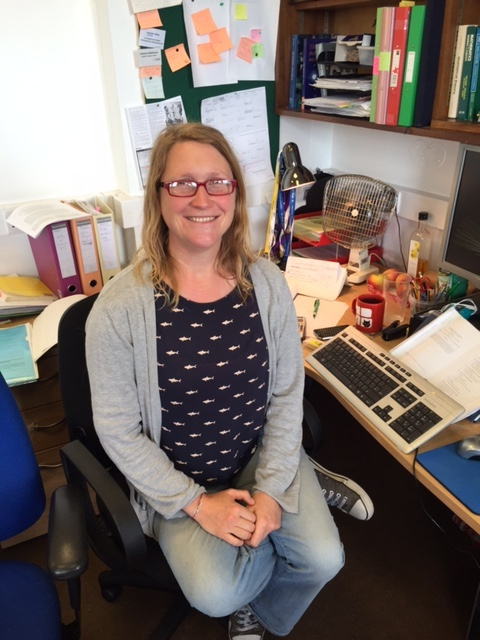

<table width="100%"><tr>
<td> <a href="research.html">Topics</a> </td>
<td> <a href="firstdawnteam.html">Team</a> </td> 
<td> <a href="projects.html">Projects</a> </td> 
<td> <a href="jobs.html">Opportunities</a> </td>
</tr></table>

### Present

<table width="100%"><tr>
<tr> <td>  </td>
<td>Emma Chapman   RAS Fellow</td></tr>
<tr> <td> </td>
<td>Catherine Watkinson   UCL Postdoc   Imperial PhD student (2011-2015)</td></tr>
<tr> <td> </td>
<td>Claude Schmit    Imperial PhD student (2015-)</td></tr> 
</tr></table>

### Past

