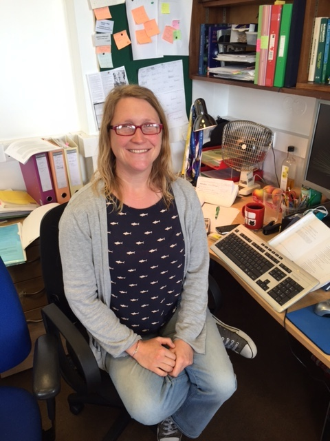
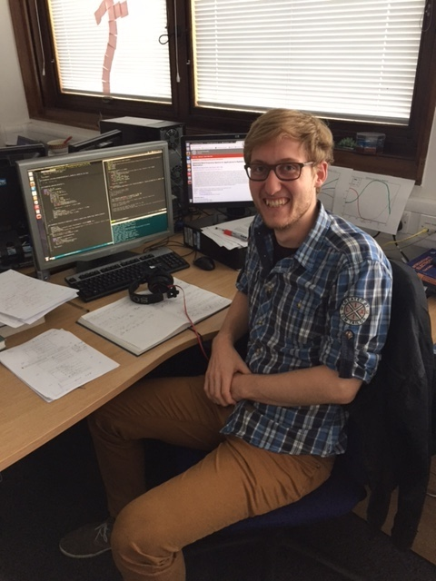

If you\'re interested in working with me, please check out this page for possible
<a href="jobs.html">opportunities</a>. 

### Postdocs

<table width="100%">
<tr> <td>  </td>
<td>Emma Chapman   RAS Fellow</td></tr>

<tr> <td> </td>
<td>Suman Majumdar    ERC Postdoc </td></tr>

<tr> <td> </td>
<td>Catherine Watkinson   UCL Postdoc   Imperial PhD student (2011-2015)</td></tr>
</table>

### Students

<table width="100%">
<tr> <td> </td>
<td>Claude Schmit    Imperial PhD student (2015-)</td></tr> 
</tr>
</table>

### Past students

Martin Rey, Paris, Imperial MSc.