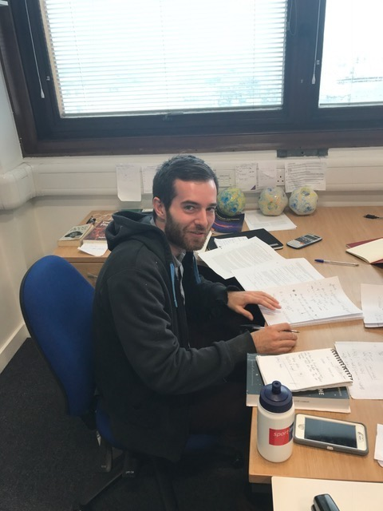

<!---
If you\'re interested in working with me, please check out this page for possible
<a href="jobs.html">opportunities</a>. 
--->

### Postdocs

<table width="100%">
<tr> <td> </td>
<td>Romain Meriot   STFC-DAE postdoc</td></tr>
</table>

### PhD Students

<table width="100%">
<tr> <td> </td>
<td>Nadia Cooper    Imperial PhD student (Oct 2023-)</td></tr> 
<tr> <td> </td>
<td>Carina Norregaard    Imperial PhD student (Oct 2022-)</td></tr> 
<tr> <td> </td>
<td>Yordan Ignatov   Imperial PhD student (Oct 2021-)</td></tr> 
</tr>
</table>

### Past Postdocs

<table width="100%">
<tr> <td>  </td>
<td>Emma Chapman   RAS Fellow</td></tr>

<tr> <td> </td>
<td>Suman Majumdar    ERC Postdoc </td></tr>

<tr> <td> </td>
<td>Catherine Watkinson   ERC Postdoc </td></tr>

</table>

### Past PhD students

<table width="100%">
<tr> <td> </td>
<td>Kimeel Sooknunan   Imperial PhD student (2019-2024)</td></tr>
<tr> <td> </td>
<td>Ian Hothi   Imperial PhD student (2018-2022)</td></tr>
<tr> <td> </td>
<td>Adelie Gorce   Imperial/Paris-Saclay PhD student (2018-2022)</td></tr>
<tr> <td> </td>
<td>Claude Schmit    Imperial PhD student (2014-2018)</td></tr> 
<tr> <td> </td>
<td>Thomas Binney   Imperial PhD student (Oct 2016-)</td></tr> 
<tr> <td> </td>
<td>Catherine Watkinson   Imperial PhD student (2011-2015)</td></tr>
</table>

### Past UG and MSc students

Solene Chabanier, Paris, MSc, Summer 2017.

Sophie Koudmani, Oxford, UROP. Summer 2016.

Martin Rey, Paris, Imperial MSc. Summer 2015.

Luke Walley, MSci project, Imperial, 2014-15.

Fred Piech, MSci project, Imperial, 2014-15.

Elizabeth Campbell, UROP, Imperial, Summer 2014.

Michelle Whitehead, MSc project, Imperial, Summer 2013
