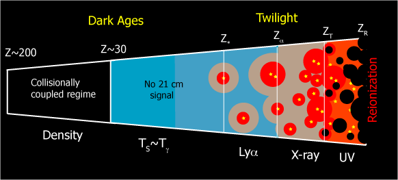
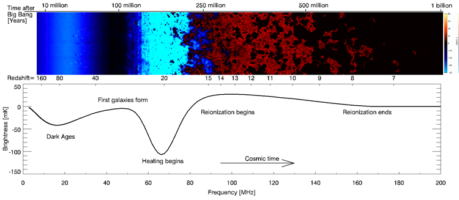
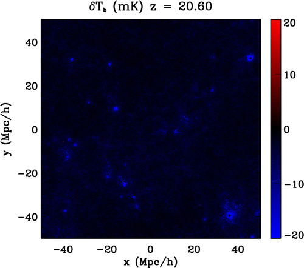
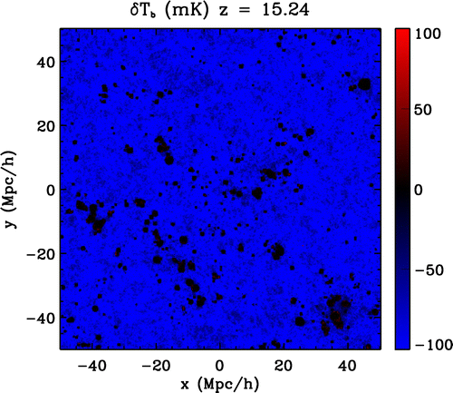
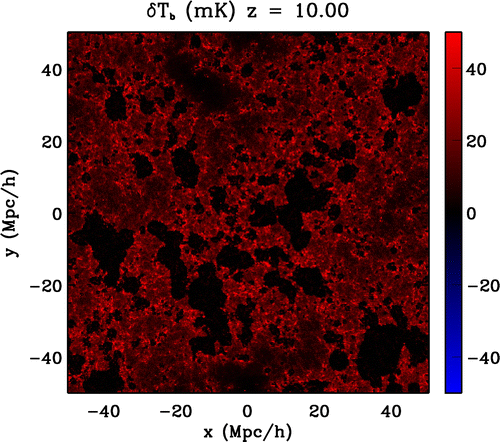
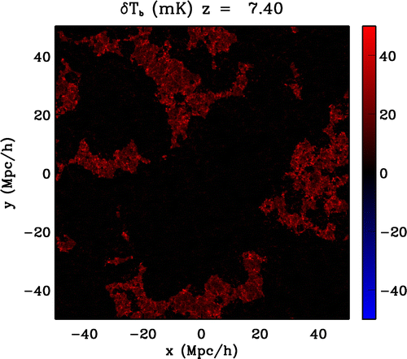
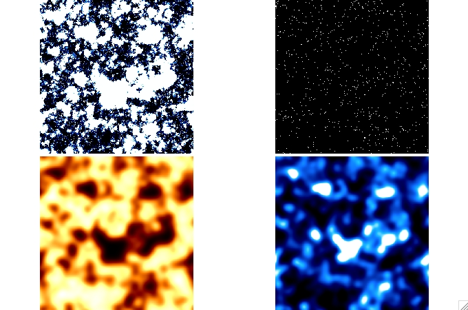

[Research collaborators](collaborators.htm)

My research interests center around trying to build a complete picture of the evolution of the Universe from the first instants after the Big Bang through to the present day.  Our understanding of the first billion years after the Big Bang is especially poor and most of my recent research has been devoted to understanding probes of this age.  Although my basic interest is on fundamental physics, much of my work has dealt with trying to understand the period where the first galaxies form and the Universe is ionized by their radiation.  This period marks the transition between linear and non-linear physics and has a lot to tell us about the physics underlying both regimes.  My current focus is the prospect of using the [21cm line](21cm/twentyone.htm) to probe the epoch of reionization (EoR).  This field is still fairly speculative, but the potential gains in our understanding of cosmology make it very exciting.

<ul>
<li>Reionization and the cosmic dark ages
<li>Applications of the 21 cm line
<li>Observational probes of inflation
<li>Galaxy formation and the growth of structure
</ul>

 Cartoon of the different phases of the 21 cm signal

 There are two ways that one can try to use the 21 cm signal.  One can make absolute temperature measurments as a function of frequency to measure the sky averaged global signal (bottom panel).  Alternatively, one can use large interferometers to measure the fluctuations in the 21 cm signal (top panel).

<table><tr><td>
</td><td></td></tr>
<tr><td></td><td></td></tr>
  </table> Four slice of the 21 cm signal at high redshift.  These show the evolution of the signal as the physics that dominates the fluctuations changes with time.  Initially, variation in the Lyman alpha photon flux produced by galaxies produces bright absorption (blue) features around galaxies - "Lyman alpha halos". Later, as more galaxies form the gas is everywhere seen in absorption.  Next, as stellar remnants form they act as sources of X-rays that heat the gas producing an emission signal (red).  Finally, ionizing photons from clusters of galaxies produce large ionized bubbles (black) that eventually expand and percolate.  

 One of the challenges facing measurements of the 21 cm signal is proving that you've detected the fluctuations.  One possibility for doing this is to cross-correlate the 21 cm signal with some other tracer of the density field.  High redshift galaxy surveys are one possibility.  Since galaxies produce ionizing radiation, where there are galaxies there should be little neutral hydrogen.  So galaxies (top right panel) and neutral hydrogen (top left panel) (and hence the 21 cm signal in the bottom left panel) are anticorrelated.  This can be seen in the figure, where the dark (ionized) patches appear where there are many galaxies.  Unfortunately, finding enough galaxies at high redshift and over a wide area of sky is hard.  One technique that shows promise is CO intensity mapping (bottom right panel).  Here all the CO emission from many galaxies (within a 6arcmin beam) is measured giving a crude mapping of the density of galaxies on the sky.  The same anti-correlation can clearly be seen - where there is CO emission there is little 21 cm emission.

  
<!--

<h2><a name="21cm">Applications of the 21 cm line</h2>

 Low-frequency radio observations of the redshifted 21 cm line of neutral hydrogen have the potential to open a new window onto the early Unvierse.

<ul>
<li><a href="#21cm">21 cm cosmology and astrophysics</a></li>
<li><a href="#reionization">Reionization, galaxy formation, and the growth of structure</a></li>
<li><a href="#inflation">Observational signatures of inflation</a></li>
</ul>

<h2><a name="21cm">21 cm cosmology and astrophysics</h2>

<h4>21 cm astrophysics</h4>

Lyman alpha, X-ray, global signal, reionization, global signal

<h4>21 cm cosmology</h4>

neutrino mass, dark matter

<h2><a name="#reionization">Reionization, galaxy formation, and the growth of structure</h2>

Observational constraints, Galaxy feedback  

<h2><a name="#inflation">Observational signatures of inflation</h2>

Gravitational Waves, Isocurvature, Running

